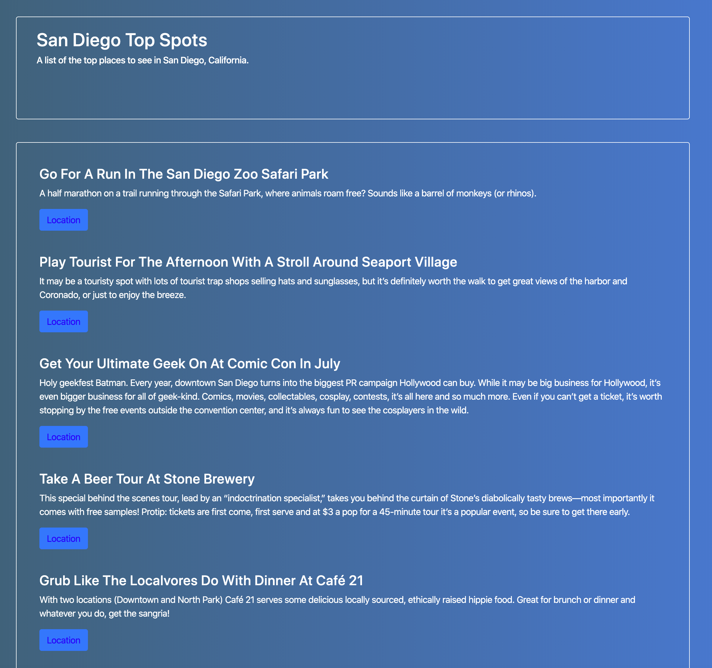
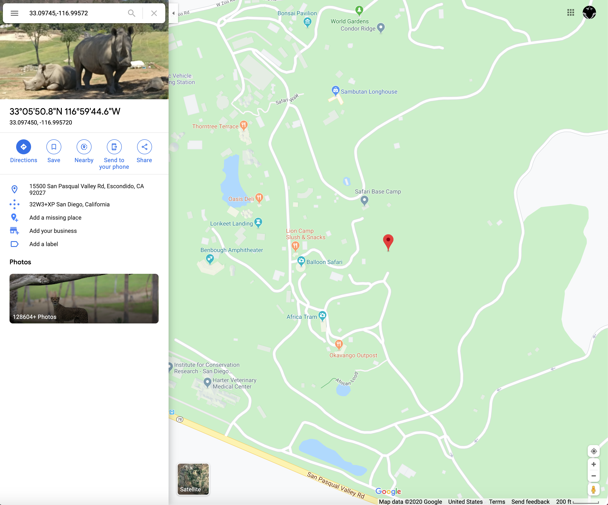

# React100-San-Diego-Top-Spots




This project uses axios to make a call for the San Diego Top Spots data and uses it to provide information 
and coordinates to use for a google maps link as shown in the secoind screenshot.

## Please feel free to demo the project by taking these steps..
```
Clone or fork the repo
```
```
npm install
```
```
npm start
```
```
Open your browser to view on localhost: 3000
```
* **Thank you**, ***-Miles Mickelson***
